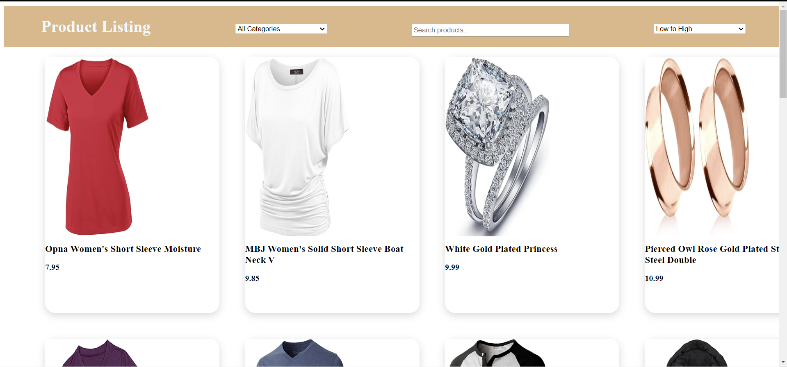

## Product Listing Web Application using FakeStoreAPI

### Objective
Develop a Product Listing Page with features like fetching product data from the FakeStoreAPI, sorting products by price, and filtering products by category.

### API Details
- **Base URL**: https://fakestoreapi.com
- **Endpoints**:
  - `/products`: Fetches all products.
  - `/products/categories`: Fetches all product categories.

### Core Features
Create an application that fetches product data from the FakeStoreAPI and displays it on a Product Listing Page. Implement the following features:

#### Product Listing Web Application
**Problem Statement**: You are tasked with developing a web application for listing and browsing products from an external API. The application should allow users to view products, filter them by category, search for specific products, and sort them by price.

#### Requirements:
#### Product Listing Page:
- Implement a product listing page where users can view a grid of product items.
- Each product item should display the product's image, title, and price.

#### Filtering by Category:
- Provide a dropdown menu or select input for users to filter products by category.
- Users should be able to select a specific category to filter products accordingly.
- Include an option to display products from all categories.

#### Search Functionality:
- Implement a search input field where users can search for products by their title.
- As users type in the search input, the product list should dynamically update to display matching products.
- The search should be case-insensitive and should match partial strings.

#### Sorting by Price:
- Provide an option for users to sort products by price in ascending or descending order.
- Implement a dropdown menu or select input for users to select the sorting order.

#### User Interface Design:
- Design the user interface to be intuitive and user-friendly.
- Ensure proper spacing, alignment, and styling for a visually appealing experience.

### GitHub Repository
Diploy Link: [Product Listing Web Application](https://product-listing-web-appliction.netlify.app/)

### Setup Instructions
1. Clone the repository to your local machine.
2. Open the project directory in your preferred code editor.
3. Install dependencies using `npm install` or `yarn install`.
4. Start the development server using `npm start` or `yarn start`.
5. Access the application in your browser at `http://localhost:3000`.

### Technologies Used
- HTML5
- CSS3
- JavaScript
- FakeStoreAPI

### Contributors
- [Mihir Das](https://github.com/mihirdas77)

### License
This project is licensed under the [MIT License](LICENSE).